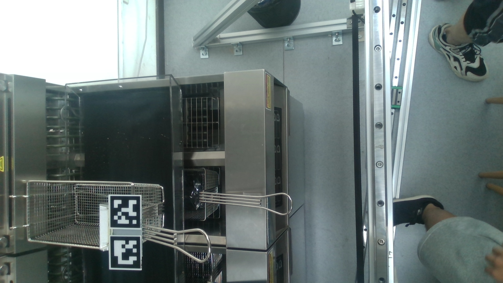

# 自动化高精度【相机标定】&【手眼标定(眼在手外)】&【偏移标定】-Python3
Camera Calibration and HandEye Calibration and Offset Calibration
by Zhi (Leo) Wang
tx.leo.wz@gmail.com
2023.04.23-06.30

我的个人主页：tx-leo.github.io
这是我大三在享刻智能EncoSmart Technology实习做的一部分工作
如果有问题可以加我的微信tx-leo-wz
享刻智能EncoSmart Technology公司主页：encosmart.com
我的产品LAVA：https://www.encosmart.com/products/Lava


# 项目介绍

这是一个自动化高精度进行相机参数标定和自动化高精度机械臂手眼标定和偏移标定的工具,精度在0.1cm以下。可实现机械臂基于apriltag的精准吸取磁铁等类似任务。主要功能有：
### 1.相机标定
### 2.手眼标定
### 3.基座移动情况下的手眼标定
### 4.偏移标定
### 5.基于视觉的机械臂抓取任务


# 功能特点

## 1.FR5机械臂asynico运动控制
采用asynico库进行机械臂的运动控制
- 主要使用PTP的运动，输入参数为机械臂末端姿态pose(x,y,z,rx,ry,rz)，关节角度信息joints(j1,j2,j3,j4,j5,j6)可以通过逆运动学反算出来,或者输入参数为关节角度信息joints(j1,j2,j3,j4,j5,j6)，末端姿态pose(x,y,z,rx,ry,rz)可以通过正运动学计算来算出来;
- 除此之外还可以获得机械臂末端的位姿;
- 开关机械臂末端工具的开合

## 2.相机参数标定

主要是通过拍摄网格板在手动设定的不同角度姿态的照片，然后使用OpenCV库来自动化标定，获得相机的内参矩阵和畸变矩阵，同时设置了四种方式来提高标定的精度：

-   1.角点亚像素级别的精度优化
-   2.设置标志位flags的精度优化
-   3.开启利用畸变校正优化
-   4.基于重投影误差的精度优化

## 3.自动化机械臂手眼标定(眼在手外)

通过线性插值设定指定空间区域内的机械臂的运动轨迹，每个xyz点有1/3/5/7中位姿，(使用asyncio库来控制机械臂)，并拍摄足够多的Apriltag标定板的照片，然后获得board2cam_xyzrxryz和end2base_xyzrxryrz，使用opencv库来算出高精度的cam2base_H，即最后需要的手眼标定齐次矩阵(Homogeneous Transformation Matrix)和深度图的比例因子(camera\_depth\_scale)

其中：

-   Apriltag标定板也可以换成网格板，只是说使用Apriltag板识别的精度高但是速度略慢(实测速度上没啥区别）
-   轨迹设定在待抓取周围空间，来提高最后的抓取精度，轨迹自动生成,先设定xyz点集，再在每个点上加上一定数量的固定位姿
-   此手眼标定是眼在手外的情况，相机固定在距离机械臂一定高度的上面(约为0.9m)，然后机械臂末端拿着apriltag板子来移动采集数据
-   此手眼标定工具也可包括基座变化的情况，通过对比手眼标定得到的cam2base_H下的基座和新的基座的xyz差值，来计算新的cam2base_H
-   手眼标定需要高精度标定后的相机参数，建议使用上述相机参数标定工具或者Matlab-Camera Calibrator工具来标定

## 4.Apriltag精准定位并实现机械臂跟随
手眼标定获得cam2base_H之后，可以实现通过相机实时测得到的apriltag的位姿，转到基于机械臂基坐标系下的位姿，然后实现机械臂实时跟随apriltag的位置，具体见src/Task.py文件，最终的跟随精度在1cm以下。

## 5.偏移标定
自动化偏移标定,通过target2base和magnet2base数据,来获取识别到的tag到最终抓取点magnet的偏移magnet2target_xyzrxryrz,这个就是磁铁到tag所需要的六个偏移值(单位是m和度),具体参考./src/Offset_Calibration.py

## 6.实现基于apriltag的视觉抓取安装磁铁的炸篮、放回炸篮到炸锅、放回炸锅到悬挂架上等任务
相机标定、手眼标定、偏移标定之后就可以进行最终的机械臂抓取任务了，参考Task.py里的这三个任务的具体实现过程

# 安装说明

创建所需环境并安装所需库：
```
conda create -n camera-calibraion-handeye-calibration python=3.8
conda activate camera-calibraion-handeye-calibration
cd camera-calibration-handeye-calibration/src
pip install -r requirements.txt
```

# 使用说明

## ①Camera-Calibration.py


【四个优化方式全带】：
```python
python3 Camera-Calibration.py                                   \
--nums_images 50                                                \
--images_path               ./camera_calibration_images         \
--pattern_size              (11,9)                              \
--square_size               0.015                                \
--camera_params_json_path   ./camera_params.json                \
--test_image_path           ./camera_calibration_images/image_0.jpg   \
--optimize_cornerSubPix                                         \
--optimize_flags                                                \
--optimize_getOptimal                                           \
--optimize_projectPoints                                        \
--max_error                 3
```

【一个优化方式都不带】
```python
python3 Camera-Calibration.py                                   \
--nums_images 50                                                \
--images_path              ./camera_calibration_images          \
--pattern_size              (11,9)                              \
--square_size               0.015                               \
--camera_params_json_path  ./camera_params.json                 \
--test_image_path          ./camera_calibration_images/image_0.jpg
```


## ②Generate-Trajectory

```python
python3 Generate-Trajectory.py      \
--cube_size 100                    \
--cube_position [500,500,500]       \
--num_points 50                     \
--trajectory_path ./trajectory.txt
```

## ③Robot

```python
python3 Robot.py                                            \
--host 192.168.1.100                                        \
--port 30003                                                \
--joints [-168.847,-93.977,-93.118,-80.262,88.985,11.831]   \
--pose [-558.082,27.343,208.135,-177.205,-0.450,89.288]
```

## ➃HandEye-Calibration

【apriltag标定板方式】

```python
python3 HandEye-Calibration.py
--num_images 50                                 \
--image_dir './handeye_calibration_images'      \
--host 192.168.1.100                            \
--port 30003                                    \
--trajectory_path './trajectory.txt  '          \
--camera_params_path './camera_params.json'     \
--ARILTAG                                       \
--tag_size 0.05
```

【网格板方式】

```python
python3 HandEye-Calibration.py
--num_images 30                                 \
--image_dir './handeye_calibration_images'      \
--host 192.168.1.100                            \
--port 30003                                    \
--trajectory_path './trajectory.txt  '          \
--camera_params_path './camera_params.json'     \
--GRID                                          \
--board_size [11, 9]                             \
--square_size 0.015
```
# 文件结构

```
./
├── README.md                               readme
├── README.pdf                              readme
├── docs                                    机械臂使用说明文档和手眼标定相关知识
├── requirements.txt                        requirements
├── src                                     存放所有重要的源代码
├── test                                    存放所有测试代码
└── videos                                  最终结果视频
```


其中

```
./src
├── Base.py                                                              
├── Camera_Calibration.py
├── Generate_Trajectory.py
├── Get_Board2Cam_xyzrxryrz.py
├── Get_Cam2Base_H.py
├── Get_End2Base_xyzrxryrz.py
├── H_R_t_xyzrxryrz_transform.py
├── HandEye_Calibration.py
├── Offset_Calibration.py
├── Robot.py
├── Task.py
├── cfg                                  存放配置所有文件（机械臂运动轨迹和相机参数
├── image                                存放相机标定照片和手眼标定照片
└── output                               存放所有的输出数据
```
# 具体函数功能说明

## Camera-Calibration.py

> 📌自动化高精度相机标定【内参矩阵和畸变矩阵】 (适用于各种相机)

-     1.capture_images()
        拍摄指定张照片，并保存（按键s保存)
-     2.calibrate_camera_SELET_cornerSubPix_or_flags_or_getOptimal_or_projectPoints()
        相机参数标定,优化方式:【1.角点亚像素级别的精度优化】【2.设置标志位flags的精度优化】【3.开启利用畸变校正优化】【4.基于重投影误差的精度优化】,优化方式可以自己任意选择搭配
-     3.save_camera_params()
        将相机参数保存到json文件
-     4.undistort_img_with_camera_matrix_and_distortion_coefficients()
        使用相机标定的参数来去除图像的畸变

## Generate-Trajectory

> 📌自动化通过设置线性步长来生成一定空间区域内的点集,顺序是除草机式,尽可能包含这个空间区域内的各个位姿(x,y,z,rx,ry,rz) (xyz单位为mm,rxryrz单位为度)

-     1.generate_trajector()
        首先设定边界和步长,线性生成xyz点集,然后把xyz点集的顺序变成除草机式,然后对于每个点xyz增加几组设定的rxryrz
-     2.optimize_points_order()
        优化点集的顺序,变成除草机式,使得机械臂尽可能短距离遍历这些点
-     3.save_trajectory()
        将采样点的数组保存为txt配置文件
-     4.test_load_trajectory()
        测试读取运动点

## Robot

> 📌机械臂运动控制，使用Socket控制方式，主要函数有

-      1.move
        关节空间运动(PTP),对于有没有joints和pose都可以兼容
        1.输入joints和pose
        2.只输入pose,joints可以逆运动学GetInverseKin解算出来
        3.只输入joints,pose可以正运动学GetForwardKin解算出来
-      2.get_pose
        获取当前位姿(x,y,z,rx,ry,rz) xyz都是以mm为单位,rxryrz都是以度位单位
-      3.GetInverseKin
        逆运动学解算,pose2joints
-      4.GetForwardKin
        正运动学解算joints2pose
-      5.switch_electromagnet
        开关电磁铁
-      6.plane_grasp
        平面抓取动作流程

## Base
> 📌串口方式控制机械臂基座沿着x轴电机的运动

## H_R_t_xyzrxryrz_transform
> 📌H(齐次矩阵),R(旋转矩阵),t(平移向量),xyzrxryrz(位姿),xyz,EulerAngle(欧拉角),Rvec(旋转矩阵)之间的转换,以及R或者xyzrxryrz的指定角度的旋转
-       1.EulerAngle_to_R(rxryrz):
        欧拉角(度)转旋转矩阵
-       2.R_to_EulerAngle(R):
        旋转矩阵转欧拉角(度)
-       3.Rvec_to_R(rvec):
        旋转向量转旋转矩阵
-       4.R_to_Rvec(R):
        旋转矩阵转旋转向量
-       5.xyz_to_t(xyz):
        xyz转平移向量t
-       6.t_to_xyz(t):
        平移向量t转xyz
-       7.xyz_rxryrz_to_xyzrxryrz(xyz,rxryrz):
        xyz和rxryrz转xyzrxryrz
-       8.Rt_to_H(R,t):
        旋转矩阵R和平移向量t结合成齐次矩阵H
-       9.H_to_Rt(H):
        齐次矩阵H转旋转矩阵R和平移向量
-       10.xyzrxryrz_to_H(xyzrxryrz):
        xyzrxryrz转齐次矩阵H
-       11.H_to_xyzrxryrz(H):
        齐次矩阵H转xyzrxryrz
-       12.rotate_xyzrxryrz(xyzrxryrz,delta_rx=0,delta_ry=0,delta_rz=0,rotate_order = 'zyx'):
        rxryrz按顺时针旋转某个角度
-       13.rotate_R(R, delta_rx=0, delta_ry=0, delta_rz=0, rotate_order='zyx'):
        R按顺时针按照指定顺序旋转某个角度

## Get_End2Base_xyzrxryrz

> 📌生成机械臂运动轨迹,拍摄标定板图像并存储,同时存储机械臂位姿end2base_xyzrxryrz(xyz以m为单位,rxryrz是欧拉角以度为单位)生成机械臂运动轨迹,拍摄标定板图像并存储,同时存储机械臂位姿end2base_xyzrxryrz(xyz以m为单位,rxryrz是欧拉角以度为单位)
-       1.get_end2base_xyzrxryrz():
        生成机械臂运动轨迹,拍摄标定板图像并存储,同时存储机械臂位姿end2base_xyzrxryrz(xyz以m为单位,rxryrz是欧拉角以度为单位)
-       2.manual_add_end2base_xyzrxryrz(robot,amount_already,num_images, image_dir):
        手动继续添加轨迹点,在给定的时间内拖动机械臂到下一个位姿，拍摄标定板图像并存储

## Get_Board2Cam_xyzrxryrz

> 📌获取每个照片的标定板相对摄像头的位姿board2cam_xyzrxryrz
-       1.get_board2cam_xyzrxryrz():
        计算每个照片的标定板相对摄像头的位姿board2cam_xyzrxryrz
     -       1.get_apriltag_board2cam_xyzrxryrz():
            计算一张照片的标定板(apriltag板)相对摄像头的位姿board2cam_xyzrxryrz
     -       2.get_grid_board2cam_xyzrxryrz():
            计算一张照片的标定板(网格板)相对摄像头的位姿board2cam_xyzrxryrz
-       2.delete_unused_end2base_xyzrxryrz():
        删除end2base_xyzrxryrz中在delete_idx的位姿

## Get_Cam2Base_H

> 📌自动化高精度手眼标定(眼在手外),获得【cam2base_H和camera_depth_scale】 (适用于各种机械臂和相机的组合)
-       1.handeye_calibration():
        利用机械臂末端位姿arrry:end2base_xyzrxryrz和标定板位姿arrry:board2cam_xyzrxryrz,使用cv2.calibrateHandEye()函数(默认为Tsai方法计算AX=XB)来获得相机到机械臂基底的变换矩阵cam2base_H;
        一共有TSAI,PARK,DANIILIDIS,HORAUD,ANDREFF这些方法,测试结果表明Park方法比较准确!!
-       2.get_camera_depth_scale():
        获得深度图的比例因子,表示深度图像素值与实际距离之间的转换关系,通常以米/像素为单位。它是通过手眼标定得到的机械臂末端在相机坐标系下的变换矩阵和相机的畸变系数来计算的。
-       3.target2cam_xyzrxryrz_to_target2base_xyzrxryrz():
        实现已知基于cam的位姿,转换到基于base的位姿
-       4.target2base_xyzrxryrz_to_end2base_xyzrxryrz():
        基于给定的最终要抓去的地方end相对于识别到的tag的相对位置xyzrxryrz偏移,以及rxryrz的偏移顺序,给定target2base_xyzrxryrz,转换为end2base_xyzrxryrz
-       5.get_new_cam2base_H():
        获取基于新基座的cam2base_H(对于基座的位置变化了的情况,需要重新算出来一个cam2base_H)
-       6.get_now_base_x():
        获取现在的机械臂x轴的坐标
-       7.test_get_all_board2end_H():
        验证是否所有的board2base_H一致

## HandEye_Calibraion

> 📌自动化高精度手眼标定(眼在手外),获得【cam2base_H和camera_depth_scale】 (适用于各种机械臂和相机的组合),直接调用Get_End2Base_xyzrxryrz.py和Get_Board2Cam_xyzrxryrz.py和Get_Cam2Base_H.py里的函数,融合三步成一个函数

## Offset_Calibration

> 📌自动化偏移标定,通过target2base和magnet2base数据,来获取识别到的tag到最终抓取点magnet的偏移magnet2target_xyzrxryrz,这个就是磁铁到tag所需要的六个偏移值(单位是m和度),其中target2base_H是识别到的tag的位姿(两个tag取平均就是中心点),单位是m和弧度.magnet2base是通过用手托动机械臂到最终要抓取的磁铁位置的位姿(直接从机械臂示教界面读取就行),单位是m和弧度。多采集几组数据生成csv文件之后放到./output/里  

## Task
主要能实现几个任务:
-        1.实现机械臂精准到达相机识别到的apriltag的位置 
-        2.实现机械臂精准遍历到达相机识别到的所有apriltag的位置
-        3.实现机械臂精准跟随相机识别到的apriltag
-        4.实现机械臂精准吸取磁铁(磁铁和apriltag在一个刚体上,相机识别到的apriltag的位置和磁铁的位置偏移是固定的)
-        5.【最终任务1】抓取炸篮(炸篮上有磁铁和tag),对应grasp_basket_magnet_by_two_tag()
-        6.【最终任务2】放回炸篮到锅里(炸锅上有tag),对应putback_basket_to_pot_by_two_tag()
-        7.【最终任务3】放回炸篮到悬挂架上(炸锅上有tag),对应putback_basket_to_bracket_by_two_tag()

所有函数说明:
-        1.open_camera_and_capture():
            打开指定的摄像头并拍摄
-        2.get_target2cam_xyzrxryrz():
            获取拍摄到的apriltag图片的位姿,并转换到base坐标系下
-        3.move_to_target():
            机械臂运动到apriltag的位置
-        4.keep_moving_to_target():
            直接打开摄像头,对视频中的apriltag实时处理,然后运动到apriltag的点
-        5.move_to_all_targets():
            直接打开摄像头,对视频中的apriltag实时处理,然后运动到所有的apriltag的点
-        6.grasp_basket_magnet(cap):
            通过识别一个放在篮子上的tag来抓取篮子上的磁铁
-        7.grasp_basket_magnet_by_two_tag(cap):
            通过识别两个放在篮子上的tag来抓取篮子上的磁铁,两个tag的中点是中心位置,所以先拍三次照片,
            求得三个中心点位姿后取平均,最后进行磁铁相对于中心tag的偏移,然后抓取磁铁
-        8.putback_basket_to_pot(cap):
            通过识别一个放在炸锅上的tag来将篮子放回炸锅里
-        9.putback_basket_to_pot_by_two_tag(cap):
            通过识别两个放在炸锅上的tag来将篮子放回炸锅里,两个tag的中点是中心位置,所以先拍三次照片,
            求得三个中心点位姿后取平均,最后进行磁铁相对于中心tag的偏移,然后抓取磁铁
-        10.putback_basket_to_bracket(cap):
            通过识别一个放在炸锅上的tag来将篮子放到炸锅前方的悬挂架上
-        11.putback_basket_to_bracket_by_two_tag(cap):
            通过识别两个个放在炸锅上的tag来将篮子放到炸锅前方的悬挂架上,两个tag的中点是中心位置,所以先拍三次照片,
            求得三个中心点位姿后取平均,最后进行磁铁相对于中心tag的偏移,然后抓取磁铁
-        12.test_grasp_basket_magnet():
            测试抓取篮子


>  &#x20;
# 参数说明
```json
{
  "tag_size": 0.050,
  "__tag_size": "tag_size指的是手眼标定时机械臂末端抓取的tag的大小(m为单位)",
  "camera_matrix": [
    [
      1347.76259273850,
      0,
      980.064627751795
    ],
    [
      0,
      1346.75069231133,
      566.103153241137
    ],
    [
      0,
      0,
      1
    ]
  ],
  "__camera_matrix": "相机内参矩阵",
  "distortion_coefficients": [
    [
      0.0655975159002847,
      -0.129478278252060,
      0,
      0,
      0
    ]
  ],
  "__distortion_coefficients": "相机畸变矩阵",
  "cam2base_H": [
    [
      -0.0347563112188074,
      -0.9993934963335931,
      -0.0021536751327675963,
      0.4553601127204395
    ],
    [
      -0.9617597409718148,
      0.032861532750979215,
      0.2719160170182792,
      0.004
    ],
    [
      -0.27168032589109253,
      0.011522115750693618,
      -0.9623185758221326,
      0.902
    ],
    [
      0.0,
      0.0,
      0.0,
      1.0
    ]
  ],
  "__cam2base_H": "相机相对于机械臂基座的齐次矩阵",
  "base_xyz": [
    820,
    0,
    0
  ],
  "__base_xyz": "机械臂基座进行手眼标定时所在的空间位置",
  "rotate_order": "zyx",
  "__rotate_order": "进行偏移标定时的旋转顺序,先绕z轴旋转,再绕y轴旋转,最后绕x轴旋转",
  "basket_delta_xyzrxryrz": [
    0.0,
    -0.036,
    0.030,
    -25,
    -23,
    -38.5
  ],
  "__basket_delta_xyzrxryrz": "吸取炸篮这个任务的六个偏移值",
  "pot_delta_xyzrxryrz": [
    0.005,
    -0.13,
    0.02,
    -32,
    -14,
    -36
  ],
  "__pot_delta_xyzrxryrz": "放炸篮到锅里这个任务的六个偏移值",
  "bracket_delta_xyz": [
    -0.053,
    -0.299,
    -0.235,
    -46,
    -19,
    -28.5
  ],
  "__bracket_delta_xyzrxryrz": "放炸篮到悬挂架上这个任务的六个偏移值",
  "robot_host": "192.168.50.2",
  "__robot_host": "机械臂ip地址",
  "robot_port": 8080,
  "__robot_port": "机械臂端口号",
  "tool_num:": 1,
  "__tool_num": "机械臂末端所使用的工具号",
  "coordinate_num": 1,
  "__coordinate_num": "机械臂所使用的坐标系标号",
  "magnet_size": 45,
  "__magnet_size": "机械臂末端使用的磁铁大小(相对于机械臂的末端)"
}
```

# 参与贡献

wangzhi\@encosmart.com | tx.leo.wz\@gmail.com

2023.4.13

# Timeline
- 2023.4.10-4.14
    - 1.机械臂运动库、机械臂相机标定和手眼标定的第一版代码的编写，以及每个模块的测试代码的编写
    - 2.完善代码，添加README.md，以及代码注释来便于其他人阅读，并将代码上传到GitLab中进行版本控制
    - 3.相机标定Camera Calibration代码已通过测试
- 2023.4.17-4.21
    - 1.realsense的相机标定使用编写的camera-calibration精准完成，对比matlab-camera calibrator工具获得的结果，结果非常准确
    - 2.测试FR5机械臂python运动库实现一定轨迹自动化运动,实现PTP的move和获取位姿
    - 3.手眼标定流程已完整过了，数据采了几组，最终的数据差距很大，待优化
- 2023.4.24-4.28
    - 1.对代码结构全部重构，完成模块化，更加易读
    - 2.手眼标定工具实现全自动化和高精度化，最终的结果cam2base_H非常准确,xyz的精度在1cm以内(和上周的错误数据对比，最关键的就是一步就是将采集的end2base_H数据进行矩阵逆运算，获得base2end_H传入到cv2.calibrateHandEye()函数中
    - 3.实现Apriltag精准定位并实现机械臂跟随，手眼标定获得cam2base_H之后，可以实现通过相机实时测得到的apriltag的位姿，转到基于机械臂基坐标系下的位姿，然后实现机械臂实时跟随apriltag的位置，最终的跟随精度在1cm以下
- 2023.05.01-05.05
    - 1.实现变化的基坐标系的cam2base_H的计算
    - 2.实现多个apriltag的空间遍历到达，最终精度在1cm左右
    - 3.添加更多的数据点，增加到189个
- 2023.05.08-05.12
    - 1.进一步提高手眼标定的精度，目前控制在3mm以下
    - 2.基于apriltag的磁铁精准吸取
- 2023.05.15-05.19
    - 1.完成在旧机器下的三个抓取任务的测试，基于指定位姿下的固定xyz偏差
    - 2.进一步提升手眼标定的精度，在5mm以下
- 2023.05.22-05.26
    - 1.完成新机器上的炸篮准确抓取（基于两个apriltag），精度在3mm以下，两个apriltag使得精度大幅度提升
    - 2.完成基于xyz和rxryrz固定偏差的代码编写和测试
- 2023.05-29-06.02
    - 1.完成5.5cm和3cm的手眼标定，5.5cm结果十分精准，3cm的较为精准，
    - 2.完成5.5cm和3cm的三个任务的实施，5.5cm的精度不错，但是3cm的情况一旦tag在距离相机1m左右的时精度就大幅度下降
- 2023.06.06-06.09
    - 1.完成4cm的手眼标定，结果较为精准
    - 2.完成4cm的三个任务的测试实施，一旦tag在距离相机1m左右的时精度就大幅度下降，多次拍照算得的位姿不一样，导致只能抛弃4cm的方案，回归5.5cm的方案！   
- 2023.06.12-06.16
    - 1.完成5.5cm的手眼标定，结果较为精准
    - 2.手眼标定过程的时间优化
- 2023.06.19-06.23
    - 1.最终方案确定为5cm的tag
    - 2.手眼标定过程的时间优化，缩短两个动作之间的时间、设定动作是否到达、优化点集
- 2023.06.26-06.30
    - 1.手眼标定时间的优化和过曝问题的初步解决：realsense的自动曝光功能
    - 2.偏移标定的编写及测试，通过，这样就大大优化了偏移量手动测量的时间
